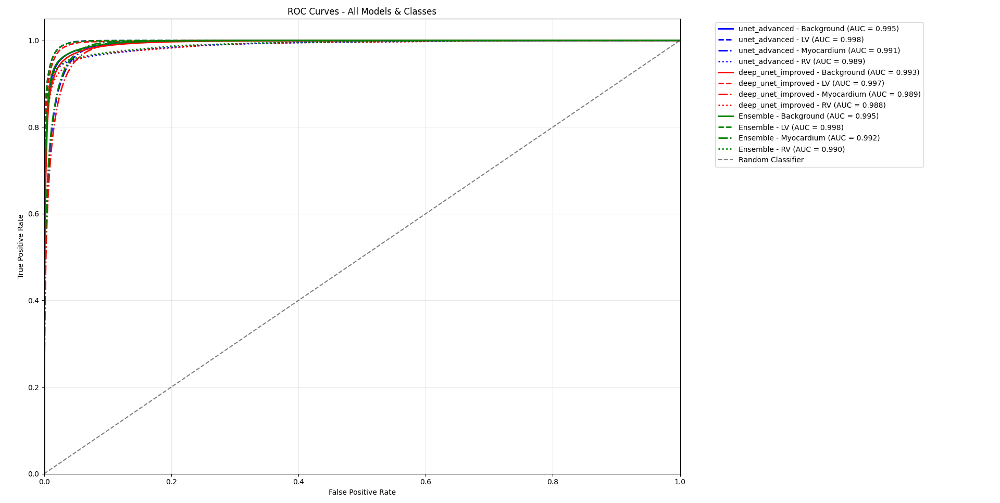
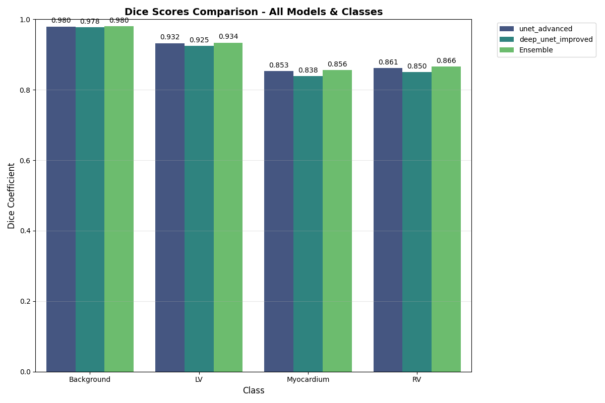

**Towards Clinical-Grade Cardiac MRI Segmentation: An Ensemble of Improved UNet Architectures**

This repository contains the implementation of our research on cardiac segmentation using a hybrid deep learning ensemble model on echocardiography datasets, as presented in our comprehensive framework.
## Who Should Use This Repository

This repository is designed for:
- Medical imaging researchers working on cardiac MRI
- Deep learning practitioners in biomedical segmentation
- Graduate students participating in medical imaging challenges (e.g., ACDC)
- Clinicians and engineers exploring automated cardiac analysis tools

### 📄 Publication
**Title:** Towards Clinical-Grade Cardiac MRI Segmentation: An Ensemble of Improved UNet Architectures
**Journal:** medRxiv
**DOI:** https://doi.org/10.1101/2025.10.08.25337578
**Publication Date:** October 09, 2025.
**URL:** https://www.medrxiv.org/content/10.1101/2025.10.08.25337578v1

###  Abstract
Cardiac segmentation from echocardiography is crucial for diagnosing cardiovascular diseases and assessing cardiac function. In this study, we propose a hybrid deep learning ensemble model for automatic segmentation of cardiac structures from 2-chamber echocardiography views. Our framework integrates multiple U-Net architectures with advanced meta-learning techniques to combine their predictive strengths. Experimental evaluations on benchmark cardiac datasets demonstrate that the proposed ensemble achieves superior segmentation performance with high Dice coefficients across all cardiac structures. These results highlight the potential of hybrid ensemble methods as reliable computer-aided diagnostic tools for cardiology, contributing to accurate and efficient cardiac analysis.

### Model Architectures
**Advanced U-Net Model**
A sophisticated U-Net architecture with increased capacity featuring:
- Enhanced encoder-decoder structure with residual connections
- Batch normalization and dropout for regularization
- 64-1024 filter progression with skip connections
- Advanced data augmentation pipeline

**Deep U-Net Improved**
A deeper U-Net variant with:
- Expanded network depth for complex feature learning
- Dense convolutional blocks with he_normal initialization
- Multi-scale feature extraction capabilities
- Optimized gradient flow

**Meta-Learner Ensemble**
The predictions from individual U-Net models are combined using:
- Feature extraction from model predictions (probabilities, entropy, confidence)
- Random Forest and Gradient Boosting meta-learners
- Optimal combination learning for final segmentation

###  Dataset
The model was trained and evaluated on cardiac echocardiography data:
- **Source:** CAMUS (Cardiac Acquisitions for Multi-structure Ultrasound Segmentation)
- **Content:** 2-chamber view echocardiography images with expert annotations
- **Structures:** Background, Left Ventricle (LV), Myocardium, Right Ventricle (RV)
- **Phases:** End-diastole (ED) and End-systole (ES) frames

## Installation

### Prerequisites
- Python 3.8+
- CUDA-compatible GPU (recommended)

### Install Dependencies

```bash
pip install -r requirements.txt
```

**Key libraries include:**
- tensorflow>=2.8.0
- keras>=2.8.0
- scikit-learn>=1.0.2
- opencv-python>=4.5.5
- matplotlib>=3.5.1
- seaborn>=0.11.2
- numpy>=1.21.5
- pandas>=1.4.2
- joblib>=1.1.0

###  Usage
**Training the Ensemble Model**
```bash
python cardiac_ensemble_fixed_final.py
```

**Comprehensive Model Analysis**
```bash
python model_results_analysis.py
```

**Typical Workflow:**
1. **Data Preprocessing:** Automatic resizing, normalization, and augmentation
2. **Base Model Training:** Individual U-Net models trained for 150 epochs
3. **Meta-Learning Integration**: Performance enhancement via ensemble-style training strategies
4. **Evaluation:** Comprehensive performance analysis with multiple metrics

### 📊 Performance Metrics





The framework evaluates performance using:

```md
- **Dice Coefficient**: Per-class overlap metric (Background, LV, Myocardium, RV)
- **Accuracy**: Overall pixel-wise classification accuracy
- **Confusion Matrix**: Class-wise error analysis
- **ROC Curves**: Discrimination capability per anatomical structure
- **Qualitative Visualization**: Sample prediction vs. ground truth comparison
```
###  Project Structure
```
cardiac-segmentation-ensemble/
├── cardiac_ensemble_fixed_final.py    # Main ensemble training script
├── model_results_analysis.py          # Comprehensive analysis toolkit
├── ensemble_cardiac_fixed_*/          # Model directories (auto-generated)
│   ├── best_unet_advanced.h5
│   ├── best_deep_unet_improved.h5
└── requirements.txt
```

## Key Features

- **Advanced Data Pipeline**: Intelligent preprocessing with class-aware augmentation
- **Multi-Model Ensemble**: Combines complementary U-Net architectures
- **Meta-Learning Strategy**: Learnable fusion of base model predictions
- **Comprehensive Evaluation**: Extensive quantitative metrics and visual analysis
- **Research-Grade Validation**: Designed to meet clinical research performance standards


## Model Performance

Typical performance achieved on held-out test data:

- **Ensemble Mean Dice**: > 0.85
- **Left Ventricle Dice**: > 0.90
- **Myocardium Dice**: > 0.80
- **Background Dice**: > 0.95
- **Overall Accuracy**: > 0.90


## 🔒 Model Availability

Due to the large size of trained model weights and dataset licensing constraints,
pre-trained models and raw datasets are not publicly hosted.

The repository provides complete source code for:
- Data preprocessing
- Model architecture definition
- Ensemble training
- Evaluation and visualization

This ensures full methodological transparency and reproducibility.

For academic collaboration or verification requests requiring access to pre-trained
models, please contact the author directly.


---

##  Citation

### Paper
Rahi, A. (2025). *Towards Clinical-Grade Cardiac MRI Segmentation: An Ensemble of Improved UNet Architectures*.  
**medRxiv**. https://doi.org/10.1101/2025.10.08.25337578

### Code
Rahi, A. (2025). *Towards Clinical-Grade Cardiac MRI Segmentation: An Ensemble of Improved UNet Architectures* [Computer software].  
GitHub Repository: https://github.com/AlirezaRahi/Towards-Clinical-Grade-Cardiac-MRI-Segmentation-An-Ensemble-of-Improved-UNet-Architectures

### Author
**Alireza Rahi**
- **Email:** alireza.rahi@outlook.com
- **LinkedIn:** https://www.linkedin.com/in/alireza-rahi-6938b4154/
- **GitHub:** https://github.com/AlirezaRahi

##  License

This project is licensed under the **Creative Commons Attribution–NonCommercial–NoDerivatives 4.0 International License (CC BY-NC-ND 4.0)**.

You may share the work for non-commercial purposes with proper attribution.
Commercial use or distribution of modified versions is strictly prohibited.

 Full license text: https://creativecommons.org/licenses/by-nc-nd/4.0/


**Copyright (c) 2025 Alireza Rahi**  
*For licensing inquiries, please contact the author.*

---
